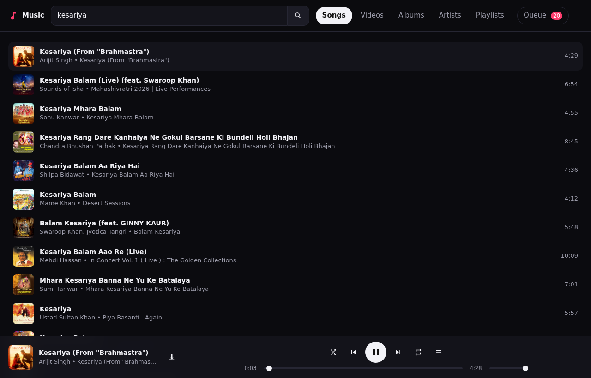
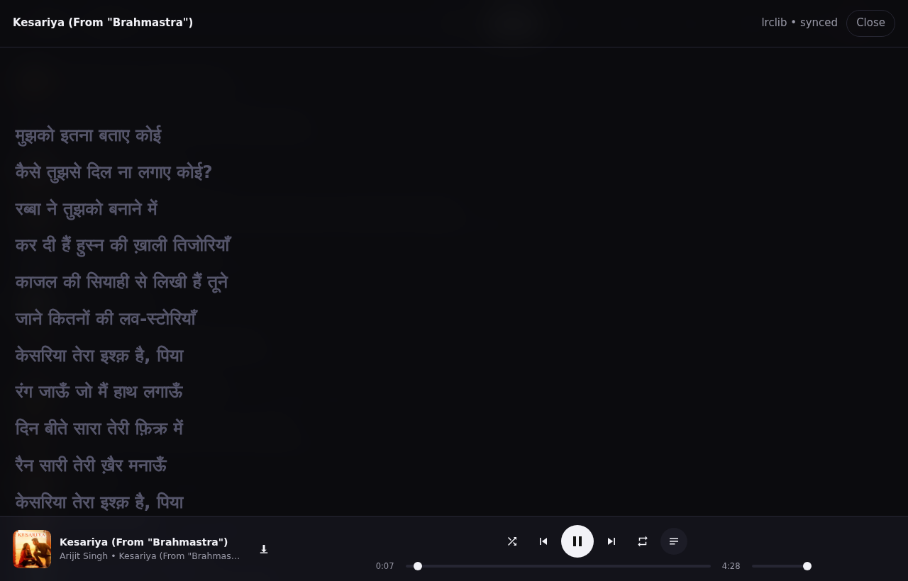

# ytmusic-web

A self-hosted web front-end for YouTube Music: search and play songs, **play YouTube
videos as songs**, queue/shuffle/repeat, **time-synced lyrics**, PWA install with
lock-screen controls, and per-track download.

It is a browser-based answer to [Metrolist](https://github.com/MetrolistGroup/Metrolist)
(an Android app), built after establishing that Metrolist itself cannot run on a
server — see [docs/FINDINGS.md](docs/FINDINGS.md).

```
┌──────────┐   1. search / lyrics    ┌────────────────────────────┐
│ browser  │ ──────────────────────► │  Fastify API               │
│  (PWA)   │                         │  • youtubei.js  (metadata) │
│          │ ◄────────────────────── │  • lrclib / YT Music lyrics│
│          │   2. audio via /stream  └───────────┬────────────────┘
└──────────┘                                     │ 3. negotiate signed URL
                                                 ▼
                                     ┌────────────────────────────┐
                                     │ headless Chromium          │
                                     │ plays the track, we relay  │
                                     │ the UMP frames it receives │
                                     └───────────┬────────────────┘
                                                 │ 4. replayed w/ browser headers
                                                 ▼
                                          rr*.googlevideo.com
```

## Why the architecture is shaped this way

Four findings drove the design (all reproduced, with commands, in
[docs/FINDINGS.md](docs/FINDINGS.md)):

1. **A stream URL resolved programmatically is useless.** `youtubei.js` can
   decipher a real `googlevideo.com` URL, but fetching it returns **HTTP 403** —
   even from the same IP, even with a valid PoToken, even from inside the browser.
   The URL that Chromium's own player uses is *not* interchangeable with the one
   the API resolves. So a real browser must negotiate playback.
2. **The browser cannot fetch the audio itself.** Google's CDN returns no
   `access-control-allow-origin` header at all (`vary: Origin`, 403 on preflight),
   so a cross-origin `fetch`/`<audio src>` from your page is impossible. The server
   must relay the bytes.
3. **Responses are UMP-framed, not plain WebM.** `Content-Type` is
   `application/vnd.yt-ump`. Concatenating it raw yields silence and neither
   `ffmpeg` nor a client `MediaSource` can decode it. The frame header must be
   stripped (`backend/src/ump.ts`).
4. **YouTube interleaves ads.** A session happily negotiates *ad* audio against the
   requested video, which is why early captures stopped after ~20 s. Ad frames
   carry the ad's own videoId in their UMP header, so the code filters on it.

The resulting pipeline: Chromium negotiates → we hold the signed URL plus the
browser's headers → we re-fetch that URL repeatedly (each request returns the *next*
UMP chunk; `range` is ignored) → demux each frame → concatenate. A 4-minute track
arrives as **~4.5 MB in ~1.5–3 s**.

## Screenshots

Search and playback (queue, shuffle/repeat, seek, download):



Time-synced lyrics, with the active line highlighted and click-to-seek:



## Endpoints

| Method | Path | Purpose |
| --- | --- | --- |
| GET | `/health` | liveness + browser/session stats |
| GET | `/api/search?q=&type=` | `song` \| `video` \| `all` (songs, videos, albums, artists, playlists) |
| GET | `/api/track/:videoId` | track metadata |
| GET | `/api/lyrics/:videoId` | time-synced lyrics (YT Music, then LRCLIB) |
| GET | `/api/upnext/:videoId` | radio / queue continuation |
| POST | `/api/play/:videoId` | negotiate playback; returns the stream URL |
| GET | `/api/stream/:videoId` | audio relay, byte-range capable once cached |
| GET | `/api/download/:videoId` | whole track as WebM/Opus |
| GET | `/api/stats` | bytes served, cache and session counters |

## Running locally

```bash
cd backend
npm install
npm run bundle:botguard        # only needed if assets/bg.bundle.js is missing

CHROMIUM_PATH=/usr/bin/chromium \
STATIC_DIR="$PWD/../frontend/public" \
PORT=10000 npm run dev
# open http://localhost:10000
```

Any Chromium/Chrome binary works; `playwright-core` does not download one.

## Deploying to Render

`render.yaml` is a ready blueprint (Docker runtime, free plan, health check at
`/health`). Push the repo, then in Render: **New → Blueprint**, pick the repo.

### Free-tier limitation (measured, not theoretical)

Render's free instance is **512 MB**, and Node idles at ~300 MB of it. Loading
YouTube Music in Chromium needs a few hundred MB more, so the container gets
**OOM-killed** and Render serves a 502 while it restarts. Search and lyrics work;
playback does not. This is documented with measurements in
[docs/FINDINGS.md §9](docs/FINDINGS.md).

To run this in practice you need a host with roughly **1 GB+ RAM**. Anything with
real egress is also a far better fit than the free tier's 5 GB/month — for example
Oracle Cloud Always Free (10 TB/month egress, 12 GB RAM) costs nothing and removes
both limits at once.

### Read this before making it public

Render's free instance gives your **entire workspace 5 GB of egress per month**,
and when it runs out Render *suspends every free service you own* until the month
rolls over — including any other projects in the same workspace. Audio costs about
1 MB per minute at 128 kbps, so 5 GB ≈ **87 hours of listening across all users**.

Mitigations built in:

- `BANDWIDTH_CAP_GB` — stop serving audio past a threshold (e.g. `4`).
- `MAX_SESSIONS` — concurrent Chromium sessions (default 2; each costs RAM).
- `RATE_LIMIT_PER_MIN` — per-IP request limit.
- `ACCESS_PASSWORD` — require a shared password on all `/api` routes.

Other free-tier facts worth knowing: the service sleeps after 15 minutes of no
inbound traffic (~1 minute cold start), has 0.1 CPU / 512 MB, and **cannot attach a
persistent disk** — so the audio cache and any downloads live on an ephemeral
filesystem and vanish on redeploy.

For a genuinely public deployment, a host with real egress is a much better fit
(Oracle Cloud Always Free includes 10 TB/month; Fly.io charges $0.02/GB).

## Configuration

| Variable | Default | Meaning |
| --- | --- | --- |
| `PORT` | `10000` | listen port |
| `CHROMIUM_PATH` | auto | Chromium/Chrome binary |
| `HEADLESS` | `true` | run Chromium headless |
| `MAX_SESSIONS` | `2` | concurrent playback sessions |
| `SESSION_TTL_MS` | `600000` | idle session lifetime |
| `BROWSER_IDLE_MS` | `180000` | close Chromium after this idle time |
| `NEGOTIATE_TIMEOUT_MS` | `30000` | playback negotiation budget |
| `CACHE_DIR` | `/tmp/ytmusic-cache` | captured audio cache (empty disables) |
| `CACHE_MAX_MB` | `512` | cache ceiling before LRU eviction |
| `CAPTURE_MAX_MS` | `150000` | per-track capture budget |
| `BANDWIDTH_CAP_GB` | `0` | stop serving after N GB in this process (0 = off) |
| `RATE_LIMIT_PER_MIN` | `60` | per-IP requests/minute on `/api` |
| `ACCESS_PASSWORD` | – | shared password for all `/api` routes |
| `STATIC_DIR` | – | serve the front-end from this directory |
| `CORS_ORIGIN` | `*` | allowed origins |

## Limitations

- **Albums, artists and playlists are listed but not browsable** — clicking one
  shows a notice. Search works for all types.
- **Seeking needs the track cached.** Until a capture finishes, the stream
  advertises `accept-ranges: none`.
- **First play takes ~5–10 s** while Chromium negotiates the track.
- **This depends on YouTube's private API** and will break when they change it.
  Nothing here circumvents DRM; it relays ordinary audio streams the same way a
  browser does. Respect YouTube's Terms of Service and your local law.

## Licence

GPL-3.0. Built on [youtubei.js](https://github.com/LuanRT/YouTube.js) (MIT) and
[bgutils-js](https://github.com/LuanRT/BgUtils) (MIT).
